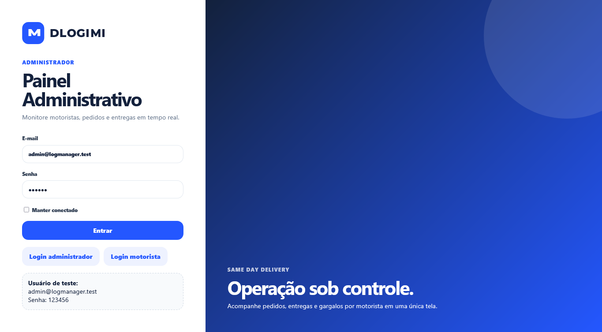
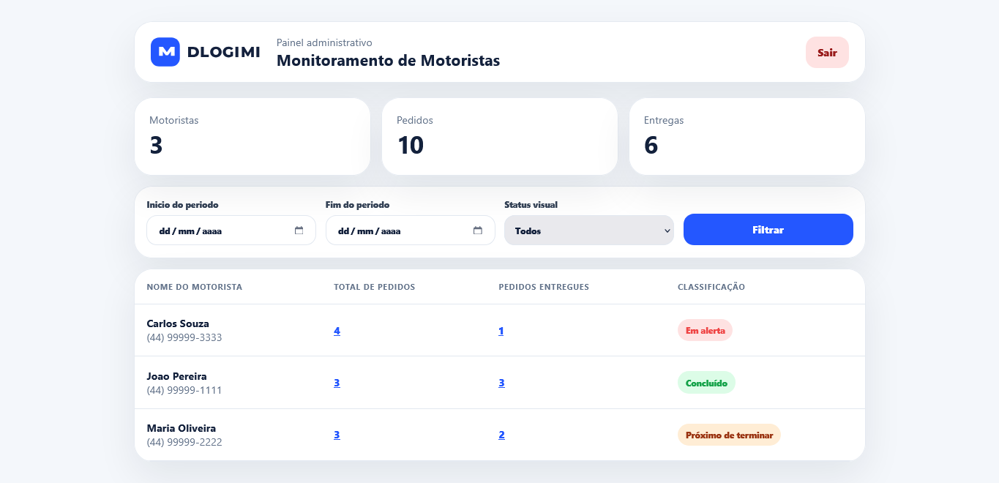
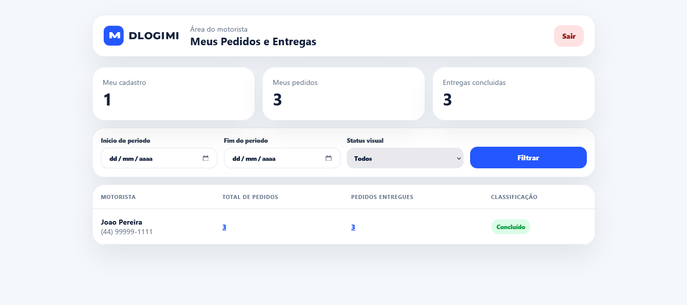
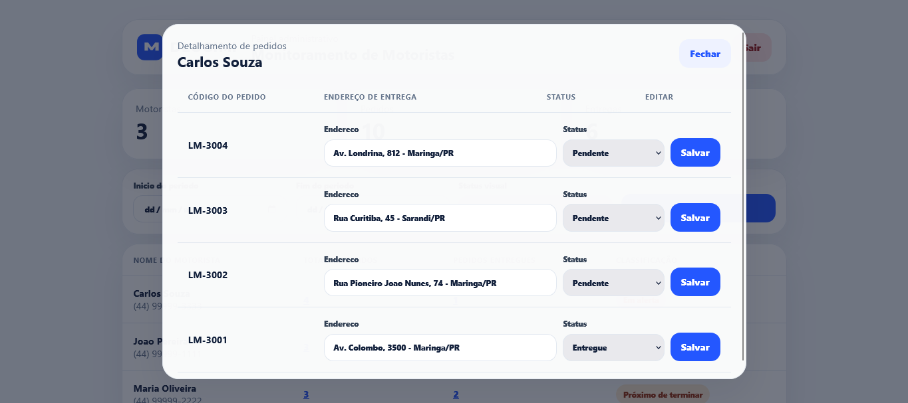
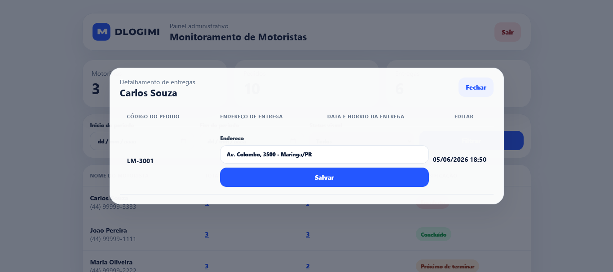
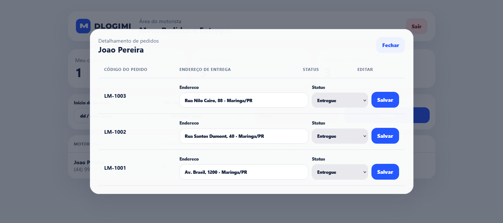
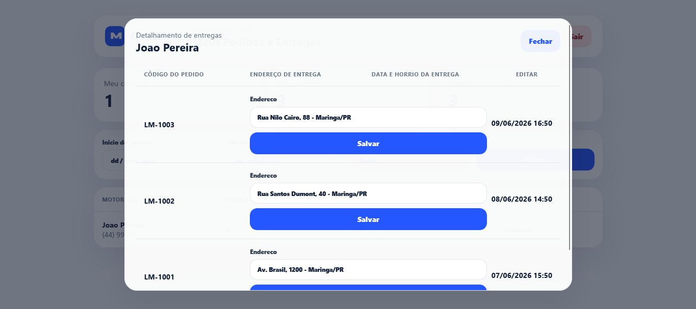

# Driver Monitoring

Teste tecnico Fullstack para a feature **Monitoramento de Motoristas**, desenvolvido em PHP/Laravel com MySQL.

## Sobre a Feature

O sistema permite acompanhar o desempenho de motoristas em pedidos de entrega no mesmo dia.

Funcionalidades implementadas:

- Login separado para administrador e motorista.
- Tela administrativa com listagem de motoristas.
- Tela do motorista com visão dos proprios pedidos.
- Filtro por período.
- Filtro por classificação visual: `Concluido`, `Proximo de terminar`, `Em alerta` e `Todos`.
- Modal ao clicar em `Pedidos`, exibindo codigo, endereço editavel e status editavel.
- Modal ao clicar em `Entregas`, exibindo apenas pedidos entregues, endereço editavel e data/hora da entrega.
- Migrations para usuarios, motoristas e pedidos.
- Seeders com dados mockados para diferentes cenarios.

## Tecnologias

- PHP `^7.3|^8.0`
- Laravel 8
- MySQL
- Blade
- CSS puro

## Instalação

```bash
cd /var/www/html/driver-monitoring-
composer install
cp .env.example .env
php artisan key:generate
```

Configure o banco no arquivo `.env`:

```env
DB_CONNECTION=mysql
DB_HOST=127.0.0.1
DB_PORT=3306
DB_DATABASE=driver_monitoring
DB_USERNAME=root
DB_PASSWORD=
```

Crie o banco de dados:

```bash
mysql -uroot -p -e "CREATE DATABASE IF NOT EXISTS driver_monitoring CHARACTER SET utf8mb4 COLLATE utf8mb4_unicode_ci;"
```

Rode migrations e seeders:

```bash
php artisan migrate --seed
```

Suba o servidor local:

```bash
php artisan serve --host=0.0.0.0 --port=8000
```

## URLs

```text
Login administrador: http://127.0.0.1:8000/login/admin
Login motorista:     http://127.0.0.1:8000/login/motorista
Dashboard admin:     http://127.0.0.1:8000/admin/motoristas
Dashboard motorista: http://127.0.0.1:8000/motorista/pedidos
```

## Usuários de Teste

Administrador:

```text
E-mail: admin@logmanager.test
Senha: 123456
```

Motoristas:

```text
E-mail: joao.motorista@logmanager.test
Senha: 123456

E-mail: maria.motorista@logmanager.test
Senha: 123456

E-mail: carlos.motorista@logmanager.test
Senha: 123456
```

## Regras de Classificação

- `Concluido`: total de entregas igual ao total de pedidos.
- `Proximo de terminar`: quantidade de entregas superior a 50% do total de pedidos.
- `Em alerta`: quantidade de entregas menor ou igual a 50% do total de pedidos.

## Dados Mockados

O seeder cria os seguintes cenarios:

- Joao Pereira: todos os pedidos entregues.
- Maria Oliveira: mais de 50% dos pedidos entregues.
- Carlos Souza: 50% ou menos dos pedidos entregues.

## Prints das Telas

Os prints ficam em `public/screenshots` e são chamados abaixo.

### Login Administrador



### Login Motorista


### Dashboard Administrador



### Dashboard Motorista



### Modal de Pedidos



### Modal de Entregas



### Modal de Pedidos do Motorista



### Modal de Entregas do Motorista



## PDF do Teste

O PDF original do teste esta salvo em:

```text
docs/Teste Dev Fullstack.pdf
```

[Abrir PDF do teste](docs/Teste%20Dev%20Fullstack.pdf)

## Logo da Empresa

Espaço reservado para inserir a logo oficial da empresa no README.

A aplicacao ja chama um logo SVG local em:

```text
public/images/logmanager-logo.svg
```

O favicon esta em:

```text
public/images/favicon.svg
```

## Observações

O prototipo do Figma informado no teste foi usado como referencia visual para compor uma interface limpa, com cards, tabela, modais e destaque por cores para a classificação operacional.
